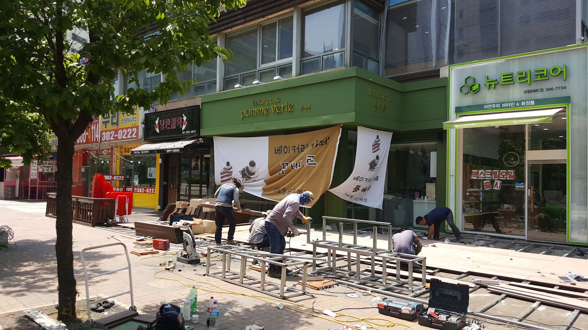
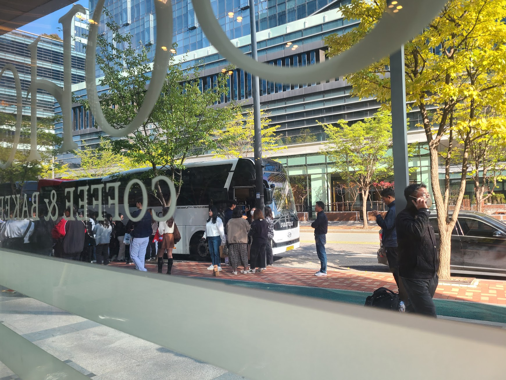

## 문제 1

Q: 다음 이미지에 대한 설명 중 옳지 않은 것은 무엇인가요?
- (1) 많은 사람들이 테이블에 앉아 컴퓨터를 사용하고 있습니다.
- (2) 이미지 상단에 "DIVE 2024 IN BUSAN"이라는 문구가 보입니다.
- (3) 사람들이 대화를 나누는 공원 장면입니다.
- (4) 실내에서 이벤트가 진행되고 있는 모습입니다.

Listening: Which of the following descriptions of the image is incorrect?
- (1) Many people are sitting at tables using computers.
- (2) The text "DIVE 2024 IN BUSAN" is visible at the top of the image.
- (3) It is a scene of people conversing in a park.
- (4) An event is taking place indoors.

정답: (3) 사람들은 공원이 아닌 실내에서 이벤트에 참여하고 있습니다.

---------------------

## 문제 2

Q: 다음 이미지에 대한 설명 중 옳지 않은 것은 무엇인가요?
- (1) 노란색 조형물이 보입니다.
- (2) "Local Stitch"라는 글자가 건물에 보입니다.
- (3) 건물 벽은 하얀색으로 칠해져 있습니다.
- (4) 건물 옥상에 식물들이 보입니다.

Listening: Which of the following descriptions of the image is incorrect?
- (1) A yellow sculpture is visible.
- (2) The words "Local Stitch" are visible on the building.
- (3) The building walls are painted white.
- (4) There are plants visible on the building's rooftop.

정답: (3) 건물 벽은 벽돌색과 갈색으로 되어 있습니다.

---------------------

## 문제 3

Q: 다음 이미지에 대한 설명 중 옳지 않은 것은 무엇인가요?
- (1) 노란색 벽이 있는 카페 내부가 보입니다.
- (2) 사람들이 카운터에서 주문을 하고 있습니다.
- (3) 테이블과 의자가 창가에 배치되어 있습니다.
- (4) 카운터에는 여러 개의 에스프레소 머신이 있습니다.

Listening: Which of the following descriptions of the image is incorrect?
- (1) It shows the interior of a cafe with a yellow wall.
- (2) People are ordering at the counter.
- (3) Tables and chairs are arranged by the window.
- (4) There are several espresso machines on the counter.

정답: (4) 카운터에는 에스프레소 머신이 여러 개가 아닌 하나 있습니다.

---------------------

## 문제 4

Q: 다음 이미지에 대한 설명 중 옳지 않은 것은 무엇인가요?
- (1) 건물에는 큰 창문이 있으며, 내부가 보입니다.
- (2) 길가에 주황색 원뿔이 놓여 있습니다.
- (3) 건물 위쪽에는 휴대전화 기지국이 설치되어 있습니다.
- (4) 벽돌로 지어진 건물입니다.

Listening: Which of the following descriptions of the image is incorrect?
- (1) The building has large windows, and the interior is visible.
- (2) There is an orange cone placed by the roadside.
- (3) A mobile phone tower is installed on top of the building.
- (4) The building is made of bricks.

정답: (3) 건물 위쪽에는 휴대전화 기지국이 아닌 에어컨이 설치되어 있습니다.

---------------------

## 문제 5

Q: 다음 이미지에 대한 설명 중 옳지 않은 것은 무엇인가요?

- (1) 다양한 종류의 빵이 진열되어 있습니다.
- (2) 점원이 빵을 정리하고 있습니다.
- (3) 빵 각각의 가격이 표시되어 있습니다.
- (4) 유리 진열장 안쪽에 케이크가 놓여 있습니다.

Listening: Which of the following descriptions of the image is incorrect?

- (1) Various types of bread are displayed.
- (2) A shop assistant is arranging the bread.
- (3) Each bread has a price listed.
- (4) There is a cake inside the glass display.

정답: (4) 유리 진열장 안쪽에는 케이크가 없고, 빵만 놓여 있습니다.

---------------------

## 문제 6

Q: 다음 이미지에 대한 설명 중 옳지 않은 것은 무엇인가요?
- (1) 사람들이 건물 밖에서 작업을 하고 있습니다.
- (2) "베이커리 카페 폼베르"라는 간판이 보입니다.
- (3) 작업자들은 헬멧을 착용하고 있습니다.
- (4) 뉴트리코어 상점은 오른쪽에 위치해 있습니다.

Listening: Which of the following descriptions of the image is incorrect?
- (1) People are working outside the building.
- (2) There is a sign for "Bakery Cafe Pomme Verte."
- (3) The workers are wearing helmets.
- (4) The Nutricore shop is located on the right.

정답: (3) 작업자들은 헬멧을 착용하고 있지 않습니다.

---------------------

## 문제 7

Q: 다음 이미지에 대한 설명 중 옳지 않은 것은 무엇인가요?
- (1) 여러 사람들이 테이블에 앉아 있는 모습이 보입니다.
- (2) 창문 밖으로 나무들이 보입니다.
- (3) 모든 테이블이 가득 차 있습니다.
- (4) 천장에 조명이 설치되어 있습니다.

Listening: Which of the following descriptions of the image is incorrect?
- (1) There are several people sitting at tables.
- (2) Trees can be seen outside the windows.
- (3) All the tables are occupied.
- (4) There are lights installed on the ceiling.

정답: (3) 모든 테이블이 가득 차 있는 것은 아닙니다. 몇몇 테이블은 비어 있습니다.

---------------------

## 문제 8

Q: 다음 이미지에 대한 설명 중 옳지 않은 것은 무엇인가요?

- (1) 버스 앞에 사람들이 줄 서 있습니다.
- (2) 창문에 "BAKERY"라는 글자가 보입니다.
- (3) 모든 사람들이 서있는 방향이 같습니다.
- (4) 한 사람이 전화 통화를 하고 있는 모습이 있습니다.

Listening: Which of the following descriptions of the image is incorrect?

- (1) People are lining up in front of the bus.
- (2) The word "BAKERY" is visible on the window.
- (3) All the people are facing the same direction.
- (4) There is a person talking on the phone.

정답: (3) 모든 사람들이 서있는 방향이 같지 않습니다.

---------------------

